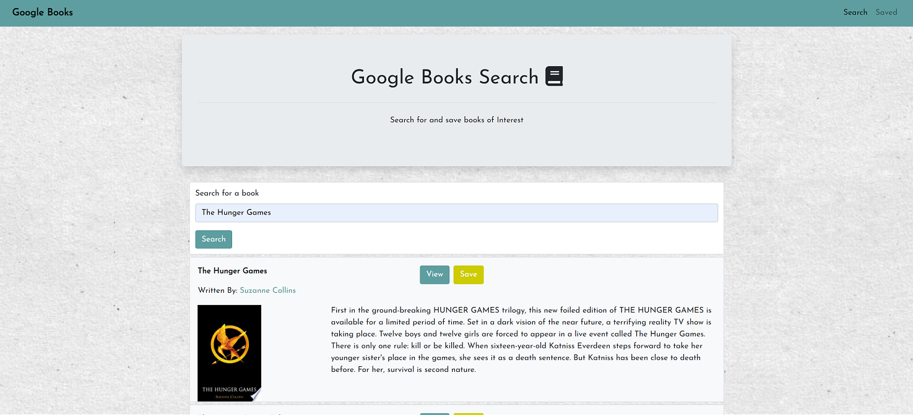

# google-book-search-react
Search and save your books of interest.

## Table of Contents

- Aim
- Usage and Instructions
- Technologies Used
- Environment

# Aim
This app is aimed to enable the user to search for books they are interested in, view the books on google's website, save the books to read at a later time and to delete any saved books.

# Usage and Instructions
The user can search for any book by name. The results will appear on the same page which will consist of multiple volumes and editions of the book and any books with the similar name. By clicking 'save' button, that book will be saved in the database and this list can be seen by going to the 'Saved' tab.       
The books can be read by clicking 'View' button which will take the user to google's website. 
Clicking the 'delete' button will delete the book from the saved list.

# Technologies Used
- React
- Node JS
- Express
- Mongoose/MongoDB
- Google Books API

# Environment

This app is hosted on Heroku @:
[google-books-search-using-react](https://react-googlebooksearchapp.herokuapp.com/)

# Future Enhancements
Would like to implement authentication and enable users to create an account, so lists can be user specific.